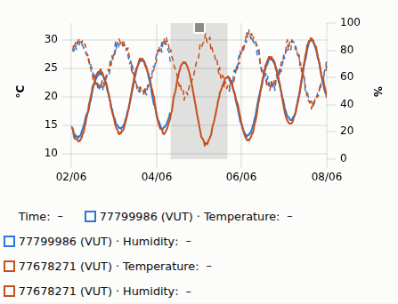

# Web portal (`web/`)

Static map portal for the SIVIN vineyard weather sensors. It is served by GitHub Pages at
`https://ricredi.github.io/SIVIN_Mateostations/` and reads only static JSON files that follow the
site data contract, [MIGRATION_PLAN.md §2.6](../MIGRATION_PLAN.md) (`schema_version: 1`). There
is no server and no API key.

Stack: TypeScript (`strict`, `noUncheckedIndexedAccess`), Vite, Leaflet (map), uPlot (time
series), ESLint (typescript-eslint, strict type-checked), Vitest (+ jsdom for DOM components).
No UI framework: components are plain TypeScript classes that own a DOM subtree.

## Run locally

```bash
cd web
npm ci
npm run dev         # http://localhost:5173/SIVIN_Mateostations/
npm run lint && npm run typecheck && npm test && npm run build   # the CI gates
npm run preview     # serves dist/ at http://localhost:4173/SIVIN_Mateostations/
npm run fixture     # regenerates the synthetic data in public/data/
npm run screenshot  # with `npm run preview` running: docs/wp_log/img/WP-3.1-*.png
```

`npm run screenshot` uses `playwright-core` with an existing Chromium (`CHROMIUM_PATH`, default
`/opt/pw-browsers/...` in the agent sandbox); it never downloads a browser.

### Base path

`vite.config.ts` sets `base: process.env.SITE_BASE ?? '/SIVIN_Mateostations/'`. All asset URLs and
the data URL (`${import.meta.env.BASE_URL}data/`) are prefixed with it. For a different host path
build with e.g. `SITE_BASE=/ npm run build`.

## Architecture

```
main.ts  (composition root: builds every object, injects collaborators through constructors)
  │
  ├─ data/      DataClient ── fetch + cache + validate ──► contract/ (types + validators)
  ├─ domain/    TimeSeries, RawSeries, Resampler, QcMask, TimeZone,
  │             TimeWindow, WindowSpec, TimeWindowFactory, ResolutionPolicy, alignSeries
  ├─ app/       SensorCatalog, ChartDataLoader, ChartPresenter        (no DOM)
  ├─ state/     Store<T>, AppState, HashStateCodec                    (no DOM)
  ├─ i18n/      I18n, LanguagePreference, cs/de/en dictionaries
  └─ ui/        App, HeaderView, MapView, SensorPanel, SensorList, TimeWindowControl,
                SeriesChart, EventMarkers, SensorColors, HashSync, palette, dom
```

Dependencies point downwards only: `ui` → `app` → `domain`/`data` → `contract`. There are no
globals or singletons; `main.ts` is the only place that touches `window`, `fetch` and
`localStorage` directly and passes them in.

| Class / module | Responsibility |
|---|---|
| `contract/types.ts` | TypeScript mirror of §2.6 (`Manifest`, `LatestFile`, `RawMonthFile`, `DailyFile`, `EventsFile`, `IndicesFile`, `SensorsGeoJSON` with the registry properties of §2.4). |
| `contract/validate*.ts`, `FieldReader`, `ContractError` | Hand-written runtime validation of every file. A mismatch throws `ContractError` with file, JSON path and problem, e.g. `manifest.json: $.schema_version must be one of [1], got 2`. Unknown extra fields are ignored (forward compatible); `schema_version` must be exactly 1. |
| `data/DataClient` | Fetches contract files relative to the data base URL, validates and caches them (one request per file per page load; failed requests are retried on the next call). `getRawRange(id, start, end)` picks the **UTC** months overlapping `[start, end)` that the manifest lists, fetches them in parallel and merges them into one `RawSeries`. A listed month that cannot be loaded is an error; months not listed are skipped. |
| `domain/RawSeries` | Columnar raw samples of one sensor, merged from monthly files, sorted by `t`, one sample per time. |
| `domain/TimeSeries` | Immutable value object of one variable (`t[]`, `values[]`, `null` = no valid value). `withGapBreaks` inserts `null` where samples are too far apart so charts draw gaps. |
| `domain/QcFlags` | `QcFlag` bits, `DEFAULT_EXCLUDE_MASK` = MISSING \| OUT_OF_RANGE \| SPIKE \| STUCK \| PRE_DEPLOYMENT \| MANUAL_EXCLUDE (§2.7) and the web's `DISPLAY_EXCLUDE_MASK` (the same without MISSING, see below); `QcMask` decides exclusion. |
| `domain/Resampler` | Raw → chart series: QC-masked raw values (gap threshold 3 × 1825 s), or hourly means over UTC hours, stamped at the **centre** of the hour (`h + 1800`) so they line up with raw samples; an hour without valid values is `null`. Daily values are not computed in the browser; they come from `daily.json` and are drawn at local noon, the centre of the day. |
| `domain/TimeZone` | Unix seconds ↔ wall-clock time of an IANA zone via `Intl` (DST-aware): local midnights, shifting by local days. |
| `domain/WindowSpec`, `TimeWindow`, `TimeWindowFactory`, `ResolutionPolicy` | What the user asked for (`24h` / `7d` / `30d` / `season` / `custom`) → a concrete `[startT, endT)` with a resolution. Details below. |
| `domain/alignSeries` | Puts several series on one union time axis for uPlot (`undefined` = no sample, skipped; `null` = gap). |
| `app/SensorCatalog` | Joins `sensors.geojson`, manifest and `latest.json` into `SensorInfo` per sensor. |
| `app/ChartDataLoader` | Loads raw / hourly / daily series and in-window events **per sensor** (`Promise.allSettled`): a sensor whose series fail becomes a failure entry shown as a per-sensor error above the chart, the other sensors still render. A missing or invalid events file degrades to "no events" with a `console.warn`. |
| `app/ChartPresenter` | Resolves the window from the state (falling back to the default window if a spec cannot be resolved), shows "loading", the data or an error; drops responses of superseded requests. |
| `state/Store`, `AppState`, `HashStateCodec` | Observable immutable state (selection, window, resolution, language) and its URL-hash form, e.g. `#s=77678271,77680921&w=7d&r=hourly&lang=cs`, `#w=season&y=2026`, `#w=custom&from=2026-06-01&to=2026-06-15`. `r` is omitted for automatic resolution. Store notifications are not re-entrant: an update made inside a listener is applied at once but notified after the current change. The codec accepts only real calendar dates (they must round-trip through `Date`) and years 2000–2100; anything else in the hash is ignored. |
| `i18n/I18n`, `LanguagePreference` | UI strings cs (default) / de / en, manifest labels, number/date formatting. Lookup: language → Czech → key. The language is stored in `localStorage` (every access in `try/catch`). Priority at start: URL hash → stored preference → Czech. |
| `ui/MapView` | Leaflet map, OSM tiles (layer switch to OpenTopoMap), fit to sensors, circle markers coloured by latest temperature, grey with dashed outline when `stale` or missing, tooltip (label, value, local time), legend as a `<details>` element (collapsed by default below 600 px). Click selects one sensor, ctrl/⌘-click toggles it in the comparison. Markers are keyboard controls: `role="button"`, in the tab order, accessible name "label: value", `aria-pressed` for the selection; Enter/Space selects, Ctrl/⌘ + Enter/Space compares. |
| `ui/SensorPanel` | Right-hand panel (bottom sheet ≤ 760 px, collapsible): sensor list, metadata and latest values of the selected sensors, time-window controls, chart. |
| `ui/SensorList` | Checkbox list of all sensors (keyboard path to the comparison). |
| `ui/TimeWindowControl` | Preset buttons (`aria-pressed`), season year, custom from–to form, resolution selector whose "automatic" entry names the resolution it picks, and a line with the concrete window and resolution actually shown ("Zobrazeno 24. 9. 2026 0:00 – 30. 9. 2026 23:59 · Surová data"; the end shown is the last minute inside the half-open window). |
| `ui/SeriesChart` | uPlot chart: temperature (left axis, °C, solid) and relative humidity (right axis, %, dashed), one colour per compared sensor, x axis in the display time zone, resizes with its container, per-sensor load errors above it. Only the canvas has `role="img"` and a name; the legend table and event buttons stay in the accessibility tree. |
| `ui/EventMarkers` | Sensor events on the chart: dashed vertical lines plus one focusable button per event with an accessible name and a tooltip (type, sensor, time, confidence, detail). |
| `ui/SensorColors` | Line colours of the compared sensors, assigned in selection order; a sensor keeps its colour while selected, a new one takes the first free colour, so the (at most 8) compared sensors never share a colour. |
| `ui/HeaderView` | Title, "demo data" badge, language switch. |
| `ui/App` | Coordinates store and views: user actions update the store, changes re-render views and reload the chart. |
| `ui/HashSync` | Two-way binding between store and `location.hash` (`replaceState`, no history spam). |

### Time windows and resolution

- Relative presets end at the end of the available data (the largest `last_t` in the manifest,
  rounded up to a full hour), not at "now": a portal whose data lag behind still shows data.
- `24h` = exactly 86 400 s. `7d` and `30d` go back 7 / 30 *local calendar days* to the same
  wall-clock time, so a 7-day window across a DST change is 7 d ± 1 h.
- `season` = 1 April 00:00 – 1 November 00:00 local time of the chosen year (the 1 Apr – 31 Oct
  period of MIGRATION_PLAN.md §3.1); years come from `manifest.seasons`.
- `custom` = whole local days from–to, both inclusive.
- Automatic resolution (`ResolutionPolicy`): ≤ 8 days raw, ≤ 62 days hourly, longer daily. The
  user can override it; the choice is part of the URL.
- Point caps for an explicit choice: raw up to 31 days (+1 h; ≈ 1470 samples per sensor), hourly
  up to 92 days (+1 h; ≤ 2209 points per sensor). Beyond a cap the next coarser resolution is
  used, and the "shown" line under the controls names the resolution actually drawn.
- A window that cannot be built (it should not happen after hash validation) falls back to the
  default 7-day window instead of failing.

### Quality flags in the chart

`qc` is one flag set per row (§2.5/§2.6), while a row holds two values. The web therefore uses
`DISPLAY_EXCLUDE_MASK` = OUT_OF_RANGE | SPIKE | STUCK | PRE_DEPLOYMENT | MANUAL_EXCLUDE, i.e. the
plan's DEFAULT_EXCLUDE **without MISSING**:

- MISSING is handled per value: a `null` value is missing, so a valid temperature is not hidden
  because the humidity of the same row is `null` (and vice versa).
- Every other excluding flag hides the whole row (both variables) at raw resolution and leaves
  it out of hourly means. A temperature SPIKE therefore also hides that row's humidity; per-variable
  QC flags would need a contract change (owner question).
- STEP, NEIGHBOR_OUTLIER and TIMESTAMP_SUSPECT are informative and do not hide data.
- Daily values are taken from `daily.json` as delivered by the pipeline.

### Colours

- Map: classed diverging scale with 9 classes, edges −5 … 30 °C in 5 °C steps. Below 10 °C (the
  base temperature of grapevine growing-degree days) four blues from ColorBrewer "Blues", from
  10 °C up five yellow-orange-browns from ColorBrewer "YlOrBr". There is no near-white class, so a
  marker never looks empty; blue/orange is the pair best kept under colour-vision deficiency.
  Stale/missing = grey fill `#7d7b74` with a dashed outline (not colour alone).
- Chart: up to 8 compared sensors; temperature solid, humidity dashed. Line colours, checked with
  the dataviz palette validator (light surface `#fcfcfb`; worst adjacent CVD ΔE 8.6, normal-vision
  ΔE 15.8) and all ≥ 3:1 against white (WCAG 1.4.11):

  | Colour | Contrast vs `#ffffff` |
  |---|---|
  | `#2a78d6` | 4.42 |
  | `#c4501f` | 4.65 |
  | `#0e8a5f` | 4.36 |
  | `#9a6b00` | 4.69 |
  | `#c2457a` | 4.74 |
  | `#008300` | 4.95 |
  | `#4a3aa7` | 8.56 |
  | `#c62f2f` | 5.46 |

### Off-site periods

`events/<id>.json` may contain interval events from the off-site log (plan §2.8,
[sensors.md](sensors.md#off-site-log)):

```json
{ "type": "off_site", "t": 1780552800, "t_end": 1780668000, "source": "log",
  "detail": "service: battery replacement" }
```

`t_end` (Unix seconds, exclusive) is required for `off_site` and is `null` while the sensor is
still off site; it is rejected on every other event type. The contract types model this as a
union (`PointSensorEvent | OffSiteEvent`, `isOffSiteEvent`), and `eventInWindow` keeps an
`off_site` period that merely overlaps the chart window (a point event must lie inside it).

`SeriesChart` draws every period that overlaps the window as a translucent grey band across the
plotting area (uPlot `drawClear` hook, under grid and lines; an open period runs to the window
end) and does **not draw that sensor's lines inside the band**: `withoutBands` blanks the
values with `startT <= t < endT` and inserts a break at the band start, so no line bridges the
band even when it holds no sample (daily means). This works from the event times alone; the
samples are also `PRE_DEPLOYMENT`-flagged and hidden by the display mask, but the band does not
depend on the flags. Lines of other compared sensors continue through the band. Each band has a
focusable grey square handle at its centre, whose accessible name and tooltip read
"Mimo vinici: <detail> – <sensor> · <from> – <to>" (de "Nicht im Weinberg", en "Not in the
vineyard"; open end "dosud" / "bis heute" / "ongoing"). The logic is in
`src/ui/EventMarkers.ts` (`offSiteBands`, `withoutBands`, `EventMarkers.drawBands`).



## Data loading (contract §2.6)

On start the app loads `manifest.json`, `sensors.geojson` and `latest.json` in parallel. Each
chart reload fetches, per selected sensor, `events/<id>.json` plus either the needed
`series/<id>/raw/<YYYY-MM>.json` months (raw and hourly) or `series/<id>/daily.json` (daily).
Every file is validated before use; a contract violation is shown as an error message in the
panel instead of a silently wrong chart.

**Raw month files are UTC months.** `series/<id>/raw/<YYYY-MM>.json` contains exactly the samples
with `t` in that calendar month in **UTC** (e.g. `2026-07` = `[2026-07-01T00:00Z,
2026-08-01T00:00Z)`), and `raw_months` lists those UTC keys. §2.6 does not say this explicitly;
this is the interpretation the web implements and **WP-3.2 (`SiteBuilder`) must follow** (it
matches §1.5 "internally always UTC"). Months in Europe/Prague time would make up to two hours
at each month boundary silently disappear from the chart. Listed as a contract clarification
for the owner. `indices/<season>.json` is typed, validated and
available through `DataClient.getIndices` but not displayed yet (WP-3.4).

## Synthetic fixture and real data

`web/public/data/` holds a **synthetic** data set generated by `scripts/generate-fixture.mjs`
(seeded PRNG, documented model, 4 real sensor positions, 1 Jun – 30 Sep 2026, step 1825 s with
a per-sensor phase and ±3 s clock jitter, ≈ 0.55 MB; sensor 77799986 has one synthetic
`off_site` service period, 4 Jun 06:00 – 5 Jun 14:00 UTC). It is
not a measurement; `public/data/README.md` says so and the UI shows a "demo data" badge.

The badge is controlled at build time by `VITE_DEMO_DATA`: any value other than `false`
(including unset) shows it. Nothing in the contract marks data as synthetic.

To use real data (WP-3.2 `SiteBuilder`, deployed by WP-4.1):

1. Generate `site/data/` with the pipeline.
2. Build with `VITE_DEMO_DATA=false npm run build`.
3. Replace `dist/data/` with the generated `site/data/` before uploading the Pages artifact
   (or copy `site/data/` into `web/public/data/` before the build). The app always reads
   `<base>/data/`; to read from elsewhere, change `DATA_BASE_URL` in `src/main.ts`.

Note: the root `.gitignore` ignores every `data/` directory, so `web/public/data/` and
`web/src/data/` were added with `git add -f`; new files there need the same until `.gitignore`
gets an exception.

## Internationalisation

- UI strings live in `src/i18n/cs.ts` (reference; defines the key type), `de.ts`, `en.ts`. The
  German and English dictionaries are typed as complete, so a missing key fails `typecheck`;
  `I18n` still falls back to Czech and then to the key at run time.
- Variable and index labels come from the manifest (`label: {cs, de, en}`), not from the
  dictionaries.
- Placeholders use `{name}`: `i18n.t('comparisonLimit', { max: 8 })`.
- To add a language: add it to `LANGUAGES` and `LOCALES` in `src/i18n/languages.ts`, add a
  dictionary and pass it in `main.ts`.

## Adding a new variable

The contract fixes the raw columns to `temp_c` and `rh_pct` and the daily columns to
`temp_*` / `rh_*`, so a new variable is **a contract change approved by the owner** first. Then:

1. `contract/types.ts` and `contract/validateSeries.ts`: add the column to `RawMonthFile` /
   `DailyFile` and validate it (same length as `t` / `date`).
2. `domain/RawSeries.ts`: add the column and extend `RawVariable`.
3. `app/ChartDataLoader.ts`: load it and map it to its daily column in `DAILY_COLUMN`.
4. `ui/SeriesChart.ts`: give it a scale and an axis (or a separate chart if its unit differs
   from °C and %).
5. Label and unit come from `manifest.variables`; add tests for validation and loading.

## Tests and coverage

`npm test` runs Vitest with V8 coverage over `src/**` and fails below 85 % of lines. Excluded
from coverage, because they are thin glue over Leaflet, uPlot/canvas or the page bootstrap and
are checked in a real browser instead: `src/main.ts`, `src/ui/MapView.ts`,
`src/ui/SeriesChart.ts`. `App` (with stub views), `EventMarkers` (with a fake uPlot) and the
other DOM components are tested under jsdom.
