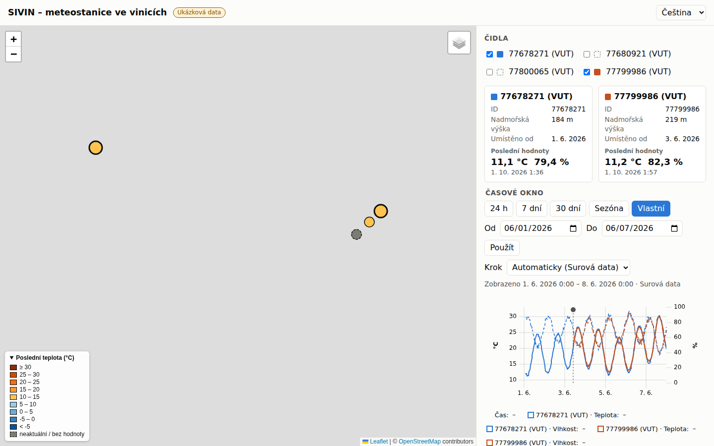
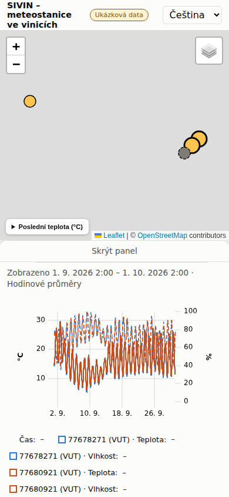

# WP-3.1 — Web portal MVP

## Summary

Added `web/`, a static map portal built with Vite, strict TypeScript, Leaflet and uPlot, with no
UI framework. It reads only the site data contract of MIGRATION_PLAN.md §2.6. Small classes with
one job each (`DataClient`, `Resampler`, `TimeWindowFactory`, `MapView`, `SensorPanel`,
`SeriesChart`, `TimeWindowControl`, `I18n`, `Store`, ...) are wired in `main.ts` through
constructors. There are no globals or singletons. Every contract file is validated at run time
and a mismatch raises `ContractError` with file and JSON path. Until WP-3.2 produces real files,
the app runs on a deterministic **synthetic** fixture in `web/public/data/` (547 KB) and shows a
"demo data" badge. The UI is in Czech, German and English. The selection, time window,
resolution and language are kept in the URL hash. A CI workflow `.github/workflows/web.yml` runs
the four web gates. Architecture and usage are in `docs/web.md`.

## Changes in round 2

These address the round-1 review; the statuses are in the Review table below.

- **URL robustness (major):** the hash codec accepts only real calendar dates (they must
  round-trip through `Date`) and years 2000–2100, for both `from`/`to` and `y`. As a safety net,
  `ChartPresenter.windowFor` falls back to the default 7-day window if a window cannot be built.
- **Store notifications are no longer re-entrant,** and `HashSync` always writes the latest
  state. Unknown sensor ids are now removed from the URL after a `hashchange` (there is a test).
- **Per-sensor loading:** a sensor that fails gets its own error line above the chart, and the
  others still render. A missing or invalid events file means "no events" plus a
  `console.warn`.
- **QC display mask:** the web uses `DISPLAY_EXCLUDE_MASK`, the default mask without MISSING. A
  `null` value already means missing, so a valid temperature is no longer hidden when only RH is
  null. All other excluding flags still hide the whole row.
- **UTC raw months:** documented in `docs/web.md` as the interpretation WP-3.2 must follow, and
  added to the owner questions. The month selection was not widened.
- **Accessibility:**
  - Map markers are keyboard buttons: `role="button"`, in the tab order, with an accessible
    name and `aria-pressed`. Enter/Space selects; Ctrl/⌘ + Enter/Space compares.
  - Only the chart canvas has `role="img"`, so the legend and event buttons stay accessible.
- **Colours:**
  - Line colours are assigned in selection order (`SensorColors`) and are stable while a sensor
    stays selected, so the at most 8 compared sensors never share a colour.
  - New line palette: all colours ≥ 3:1 against white and colour-blind checked; the ratios are
    in `docs/web.md`.
  - The stale fill is darker (4.24:1).
  - The map scale now has no near-white class: blues below 10 °C and YlOrBr from 10 °C up.
- **Map legend:** it is a `<details>` element, collapsed by default below 600 px.
- **Concrete window:** a line under the time controls shows the window actually drawn (local
  from–to) and the resolution.
- **Hourly means** are stamped at the bin centre (`h + 1800`).
- **Point caps:** an explicit raw resolution is capped at 31 days and hourly at 92 days. Beyond
  that, the next coarser resolution is used.
- **Fixture:** samples now have ±3 s clock jitter, and the fixture was regenerated (546,421 bytes).
- **Code structure and tests:**
  - `SeriesChart` was split; the event markers are now `ui/EventMarkers.ts`.
  - `App` depends on small view interfaces, and is now covered by a jsdom test with stub views.
  - `EventMarkers` is tested with a fake uPlot.

## Changed files

- `web/package.json`, `web/package-lock.json`, `web/tsconfig.json`, `web/vite.config.ts`
  (also Vitest and coverage config), `web/eslint.config.js`, `web/.gitignore`, `web/index.html`
- `web/src/contract/*`: types mirroring §2.6/§2.4, `FieldReader`, validators, `ContractError`
- `web/src/data/*`: `DataClient`, `DataLoadError`, `utcMonthKeys`
- `web/src/domain/*`: `TimeSeries`, `RawSeries`, `Resampler`, `QcFlags`/`QcMask`, `TimeZone`,
  `TimeWindow`, `WindowSpec`, `TimeWindowFactory`, `ResolutionPolicy`, `alignSeries`,
  `dailyColumnSeries`, `units`
- `web/src/app/*`: `SensorCatalog`, `ChartDataLoader`, `ChartPresenter`
- `web/src/state/*`: `Store`, `AppState` (+ selection helpers), `HashStateCodec`
- `web/src/i18n/*`: `I18n`, `LanguagePreference`, `languages`, `cs`/`de`/`en`
- `web/src/ui/*`: `App`, `HeaderView`, `MapView`, `SensorPanel`, `SensorList`,
  `TimeWindowControl`, `SeriesChart`, `EventMarkers`, `SensorColors`, `HashSync`, `palette`, `dom`; `web/src/styles.css`,
  `web/src/main.ts`, `web/src/vite-env.d.ts`
- `web/tests/**`: 14 test files (128 tests)
- `web/scripts/generate-fixture.mjs`, `web/scripts/screenshot.mjs`
- `web/public/data/**`: synthetic fixture (29 files incl. `README.md`)
- `.github/workflows/web.yml`
- `docs/web.md`, `docs/wp_log/WP-3.1.md`, `docs/wp_log/img/WP-3.1-desktop.png`,
  `docs/wp_log/img/WP-3.1-mobile.png`

## How it was verified

Gates, run in `/home/user/wt/wp-3.1/web` after `rm -rf node_modules dist coverage && npm ci`
(Node 22.22.0, npm 10.9.4):

```
npm run lint       → eslint . (no output, exit 0)
npm run typecheck  → tsc --noEmit (no output, exit 0)
npm test           → Test Files  14 passed (14)
                     Tests  128 passed (128)
                     Statements   : 99.43% ( 875/880 )
                     Branches     : 89.24% ( 332/372 )
                     Functions    : 100% ( 239/239 )
                     Lines        : 99.4% ( 842/847 )
npm run build      → dist/assets/index-*.css 23.5 kB,
                     dist/assets/index-*.js 246.6 kB (gzip 82.0 kB), ✓ built
```

- **Coverage scope:** `src/**/*.ts`, minimum 85 % lines (enforced in `vite.config.ts`).
  Excluded as thin glue: `src/main.ts`, `src/ui/MapView.ts` (Leaflet) and
  `src/ui/SeriesChart.ts` (uPlot/canvas). `App` (stub views), `EventMarkers` (fake uPlot) and
  the other DOM components are tested under jsdom.
- **Tests with hand-computed expectations:**
  - Contract validation: the whole fixture passes, and broken files fail with exact messages.
  - `DataClient.getRawRange`: month selection across a boundary, windows outside the data,
    months not in the manifest, a missing listed month, a foreign `sensor_id`, caching, network
    and JSON errors.
  - Merging and sorting with duplicates.
  - `Resampler` hourly means with nulls, SPIKE (excluded) and STEP (kept), plus gap breaks.
  - `TimeZone` across both 2026 DST transitions.
  - `TimeWindowFactory`: 24 h / 7 d / 30 d, season 2026, a 7-day window over 25 Oct 2026
    (7 d + 1 h), custom ranges in either order, and resolution limits.
  - URL hash round-trips, including the documented example
    `#s=77678271,77680921&w=7d&r=hourly&lang=cs`.
  - `I18n` fallback (language → Czech → key) and `LanguagePreference` with throwing storage.
  - `TimeWindowControl`, `SensorPanel`, `SensorList`, `HeaderView` and `HashSync` in jsdom.
- **Base path:** `dist/index.html` references `/SIVIN_Mateostations/assets/...` and the app
  loads data from `/SIVIN_Mateostations/data/`. Checked with `vite preview`.
- **Browser check:** headless Chromium from `/opt/pw-browsers` against `vite preview`:
  - No page errors.
  - At 360, 390 and 1440 px, `document.scrollWidth` equals the viewport width, so there is no
    horizontal scroll.
  - Plain marker click selects one sensor; ctrl-click adds a sensor; a checkbox toggled from the
    keyboard (Space) adds a sensor.
  - The season preset switches to "Automatic (Daily means)".
  - The language switch updates the title, the hash and `localStorage`.
  - An unknown sensor id in the hash is dropped.
  - Event markers are rendered.
- **Round 2 browser checks:** headless Chromium against `vite preview`, using the reviewer's
  `drive2.mjs` plus my own script. No page errors in any of them:
  - URLs with `to=2026-13-45`, `0001…9999` + `r=hourly`, `y=0000`, and a `hashchange` to
    `2026-02-30` all fall back to `w=7d` and the chart renders.
  - All four markers have `tabindex=0`, `role=button` and a name like
    `77678271 (VUT): 11,1 °C`, and Enter on a marker selects it.
  - With a 404 on one raw month of 77680921 and on `events/77678271.json`, one per-sensor error
    line is shown and 77678271 still renders.
  - The canvas has `role=img`; the plot host has no role.
  - The legend is collapsed at 390 px and opens on click; it is open at 1440 px.
- **Fixture:** `npm run fixture` is deterministic (same md5 on rerun). It is 546,421 bytes,
  well under 3 MB.

Screenshots (Chromium, `npm run screenshot`). Map tiles are **blank** because the sandbox cannot
reach the OpenStreetMap tile servers:

- Desktop, 1440 × 900: sensors 77678271 + 77799986, custom window 1–7 Jun 2026, raw data. The
  orange sensor starts after its `deployment` marker on 3 Jun, because its office period is
  flagged `PRE_DEPLOYMENT` and hidden.
  
- Phone, 390 × 844: 77678271 + 77680921, 30 days with automatic hourly means, bottom sheet
  scrolled to the chart.
  

## What did not work / what was not verified

- **Map tiles:** OSM/OpenTopoMap tiles never loaded in the sandbox (`ERR_TUNNEL_CONNECTION_FAILED`),
  so the tile layers, the layer switch and the attribution have not been seen with real tiles.
- **GitHub Actions:** `web.yml` has not run on GitHub. The same commands passed locally.
- **Real data:** not tested against real data. WP-3.2 does not exist yet; everything runs on the
  synthetic fixture.
- **Browsers and devices:** only headless Chromium was tested; no Firefox, Safari or real phones.
  No screen-reader test was done.
- **Map keyboard access:** since round 2 the markers are keyboard buttons (Tab, Enter/Space,
  Ctrl/⌘ + Enter/Space). This was checked only in headless Chromium, with no screen reader. In
  round 1 this note wrongly said the markers were not focusable.
- **Date inputs:** the native `<input type="date">` shows the browser's locale (US format in
  headless Chromium), not the UI language.
- **Event markers and per-sensor errors:** checked in Chromium and with jsdom tests; not checked
  with a screen reader.

## Deviations from the brief (and why)

- **`contract.ts` became the directory `src/contract/`** (`types.ts`, `FieldReader.ts`,
  `validateMeta.ts`, `validateSeries.ts`, `validateSensors.ts`, `index.ts`). This keeps files
  small, and it is imported as `../contract`.
- **TypeScript 6.0.3, not 7.x:** typescript-eslint 8.71 supports TypeScript `<6.1.0`.
- **`playwright-core` is a devDependency** (no browser download) for `npm run screenshot`, so the
  screenshots can be reproduced.
- **One `eslint-disable-next-line`** in `SeriesChart.ts`. uPlot's `Axis.Side` is an ambient
  `const enum` that cannot be referenced under `isolatedModules`, so the numeric value is used,
  with a reason comment.
- **Relative presets end at the end of the data, not at "now".** The end is the largest
  `last_t`, rounded up to a full hour. With "now" (5 Oct 2026), the fixture, which ends on
  30 Sep, would show an empty 24 h / 7 d chart; real data lag behind by up to a cron interval.
- **7 d / 30 d count local calendar days** (same wall-clock time), so they are 7 d ± 1 h across a
  DST change. 24 h is exactly 86,400 s.
- **QC-excluded samples are hidden at raw resolution too** (with `DISPLAY_EXCLUDE_MASK` since round 2, i.e. MISSING is handled per value), not only in hourly means, so the
  office period of a sensor appears as a gap before its deployment marker.
- **Hourly means are stamped at the centre of the hour** (round 2; round 1 used the start).
- **Point caps:** an explicitly chosen raw resolution is capped at 31 days and hourly at 92
  days; beyond that, the next coarser resolution is used.
- **Comparison is capped at 8 sensors**, the size of the colour-blind-checked palette. Colours are assigned in selection order. A further
  sensor is refused with a message.
- **The fixture placement dates are synthetic** (1 Jun 2026, and 3 Jun for 77799986). The plan's
  §2.4 example uses `2025-12-01` as its own placeholder. Real dates wait for Q3.

## Out of scope

- **`.gitignore` (root, owned by WP-0.1)** ignores every `data/` directory and every `*.png`.
  This hits `web/public/data/` (fixture), `web/src/data/` (the `DataClient` sources) and the
  screenshots. All of them were committed with `git add -f`, and new files there need the same.
  Proposal: add `!web/public/data/`, `!web/src/data/` and `!docs/wp_log/img/`, or the targeted
  rules WP-0.1 task 4 already plans.
- **Deployment to Pages** is WP-4.1. At deploy time it must build with `VITE_DEMO_DATA=false`
  and put `site/data/` at `dist/data/` (see `docs/web.md`).
- **Showing `indices/<season>.json`:** it is typed, validated and loaded by
  `DataClient.getIndices`, but nothing displays it. Display belongs to WP-3.4.
- **Toggle for QC-excluded data:** a "show QC-excluded values" option for researchers who want to
  see e.g. the office period. This is a small UI addition and is not done.

## Open questions for the owner

1. **Contract details implemented leniently:** §2.6 shows these fields only by example, so I
   accept them as follows:
   - `null` for daily statistics on a day without valid data;
   - `null` or missing for `class` in `indices`, and for `confidence` and `detail` in `events`
     (e.g. events taken from the registry);
   - `null` or missing for `elevation_m` and `note` in a placement.

   The contract itself is unchanged. Please confirm, or WP-3.2 should always write these fields.
2. **Two y-axes:** temperature (left) and humidity (right) share one chart, as the brief
   requires. Dataviz guidelines advise against dual axes; the alternative is two stacked charts
   with a shared time axis. Keep it as is?
3. **Marker colours** (resolved in round 2: the scale now uses blues below 10 °C and YlOrBr
   from 10 °C up, with no near-white class; please confirm you like it). Original question: the map's neutral class 10–15 °C is almost white, so on a mild day the
   markers look empty (see the desktop screenshot, 11 °C). Is the diverging scale centred near
   the vine base temperature acceptable, or would you prefer a sequential scale?
4. **Should relative presets end at "now"** instead of at the end of the data? The concrete
   window is now shown under the controls.
5. **Contract clarification of §2.6: raw months are UTC months.** The web reads
   `raw/<YYYY-MM>.json` as the UTC calendar month and expects `raw_months` to list UTC keys.
   §2.6 does not say this. Please confirm, so that WP-3.2 writes UTC months; with local months,
   up to two hours around each month boundary would be lost.
6. **Per-variable QC flags:** `qc` is one value per row, but a row holds two variables. WP-0.1
   raised the same question. Until it is decided:
   - the web ignores MISSING for display (`null` already marks a missing value);
   - every other excluding flag hides both variables of the row, so a temperature SPIKE also
     hides that row's humidity.

   Should `qc` become per variable (e.g. `qc_temp`, `qc_rh`)? That would be a contract change.
7. **Complete list of lenient readings** (reviewer nit 12), adding to question 1: the validators
   also accept a missing `site`, `variety` or `notes` in the registry (read as `null`), and
   `null` for an index `value`. The cleaner contract is that WP-3.2 always writes these keys,
   with `null` where needed.

## Review

Verdict: CHANGES_REQUESTED (round 1)

Reviewer: independent reviewer agent, 2026-10-05. Base `claude/funny-sagan-jge9is`, head `65d8531`.

### Gates observed

`cd web && npm ci && npm run lint && npm run typecheck && npm test && npm run build` → exit 0.
`npm ci`: only `EBADENGINE` warnings (jsdom deps want Node ≥ 22.22.2, sandbox has 22.22.0; dev only).
Lint and typecheck: clean. Vitest: 12 files, 96 tests passed; lines 99.56 %, branches 88.53 %
(with `main.ts`, `App.ts`, `MapView.ts` and `SeriesChart.ts` excluded). Build: JS 242.7 kB (gzip 80.8 kB),
`dist/index.html` uses `/SIVIN_Mateostations/assets/...`.

### What I verified myself

- Scope: only `web/**`, `.github/workflows/web.yml`, `docs/web.md`, `docs/wp_log/WP-3.1.md` and
  `docs/wp_log/img/*` changed. The root `.gitignore` is untouched (`git add -f` is accepted).
- Contract: every type and validator in `web/src/contract/**`, compared field by field with §2.6 and §2.4.
  Every file of `web/public/data/**` matches. The manifest/latest/raw/daily/events/indices/registry
  shapes, columnar layout, Unix seconds and `null` for missing values are all correct. The fixture is
  marked synthetic (README, placement `note`, `detail` texts, demo badge).
- QC mask: `DEFAULT_EXCLUDE_MASK` = 311 = 1|2|4|16|32|256. It matches the §2.7 column "Vylučuje z indexů".
- Time (throwaway vitest probe outside the repo): `toUtc` maps skipped 29 Mar 02:30 to 01:30Z and
  ambiguous 25 Oct 02:30 to 00:30Z (earlier instant). Local midnights on both DST days are correct.
  `utcMonthKeys` is correct at the UTC month and year boundaries and for a half-open end. The 7 d
  window over 25 Oct is 169 h. The season is 1 Apr 00:00 to 1 Nov 00:00 local.
- Browser (vite preview + playwright-core + /opt/pw-browsers Chromium, tiles blocked):
  - No horizontal scroll at 360 px. The chart follows a viewport resize (336 → 447 px).
  - After 30 preset switches there is still exactly one `.uplot` root and one event-marker layer,
    so there is no chart leak.
  - Switching to German relabels the legend.
  - Checkboxes have a 3 px focus outline.
- XSS: I injected `` / `<svg onload>` into the registry `label`, `site` and placement
  `note`, and into an event's `detail`/`source`. No dialog fired and no element was injected. All
  text goes through `textContent`/`setAttribute`. Leaflet tooltips get an `HTMLElement`, and uPlot
  legend labels are set with `textContent` (checked in uplot 1.6.32 source). `innerHTML` is not used in `src/`.

### Findings

| Severity | File:line | Finding | Status |
|---|---|---|---|
| major | web/src/state/HashStateCodec.ts:79, web/src/domain/TimeZone.ts:111, web/src/domain/TimeWindowFactory.ts:68 | A malformed custom date in a shared URL breaks the whole app | fixed (round 2): only real dates in years 2000–2100 are accepted; `windowFor` falls back to the default window; tests added |
| minor | web/src/ui/HashSync.ts:18 (with web/src/ui/App.ts:85-88) | After a `hashchange`, unknown sensor ids stay in the URL | fixed (round 2): store notifications are not re-entrant and `HashSync` writes the latest state; `App.test.ts` covers this |
| minor | web/src/app/ChartDataLoader.ts:53 | One missing or unexpected events file (or one failing raw month) fails the chart for every selected sensor | fixed (round 2): data load per sensor with a per-sensor error line; events fall back to none plus a warning |
| minor | web/src/domain/RawSeries.ts:73 | The row-level `qc` with MISSING hides a valid temperature when only RH is missing (seen in the fixture) | fixed in the web (round 2): `DISPLAY_EXCLUDE_MASK` without MISSING, documented; per-variable QC is open question 6 |
| minor | web/src/data/DataClient.ts:102 | `raw/<YYYY-MM>` is read as a UTC month, which §2.6 does not say | accepted (round 2): UTC months kept and documented in `docs/web.md` for WP-3.2; open question 5 |
| minor | web/src/ui/MapView.ts:62 | Map markers are unnamed, inoperable tab stops; the hand-off says they are not focusable | fixed (round 2): `role=button`, a name, `aria-pressed`, Enter/Space; docs updated |
| minor | web/src/ui/SeriesChart.ts:65 | `role="img"` wraps the uPlot legend and the focusable event-marker buttons | fixed (round 2): `role=img` and the name are on the canvas only |
| minor | web/src/ui/palette.ts:19 | Colour by registry index wraps at 8, so two compared sensors can share a colour | fixed (round 2): colours are assigned in selection order and stay stable while selected (`SensorColors`) |
| minor | web/src/ui/palette.ts:7-16 | Several sensor line colours are below 3:1 against white | fixed (round 2): new palette with all colours ≥ 3:1 and CVD checked; ratios documented and tested |
| minor | web/src/ui/TimeWindowControl.ts (render) | Relative presets end at the data end, but the concrete window is never shown | fixed (round 2): a "Zobrazeno from – to · resolution" line under the controls |
| nit | web/src/domain/Resampler.ts:56 | Hourly means stamped at the start of the hour draw 30 min early compared with raw | fixed (round 2): stamped at the bin centre |
| nit | web/src/contract/validateSensors.ts:39-45, validateMeta.ts:394 | Lenient readings go beyond the hand-off list | accepted (round 2): the lenient readings are kept, and the complete list is now open question 7 |
| nit | web/src/domain/Resampler.ts:44-45 | No bound on the hourly bin count | fixed (round 2): URL years are limited to 2000–2100, explicit hourly is capped at 92 days and raw at 31 days |
| nit | web/scripts/generate-fixture.mjs | The fixture step is exactly 1825 s with no clock drift or jitter | fixed (round 2): ±3 s Gaussian clock jitter added |
| nit | web/vite.config.ts:310-315 | `App.ts` is excluded from coverage, but it is coordination logic | fixed (round 2): `App` is covered by a jsdom test with stub views; `SeriesChart` was split (204 lines incl. imports; `EventMarkers` is 91) |

#### Details

1. **major: a malformed custom date in the URL breaks the app.**
   - `ISO_DATE_PATTERN` checks only the shape `\d{4}-\d{2}-\d{2}`. `#w=custom&from=2026-06-01&to=2026-13-45`
     reaches `TimeZone.nextIsoDate`, where `Date.parse` gives NaN and `toISOString()` throws
     `RangeError: Invalid time value`.
   - `…&to=9999-12-31` produces `+010000-01-01`, and `startOfDate` throws.
   - `App.start()` → `renderAll()` → `presenter.windowFor()` is not guarded. The page shows only the
     raw text "Invalid time value" in `#status` and the chart never loads (reproduced in Chromium).
     The same input through `hashchange` gives an uncaught page error.
   - This breaks the documented promise "invalid fields are left out" in `decode`, and shareable
     URLs are a feature of the app.
   - Fix: in `decodeWindow`, accept a date only if it round-trips. That means
     `new Date(Date.UTC(y, m-1, d)).toISOString().slice(0, 10) === text`, with a sane year range
     (for example 2000–2100, and also for `y=`).
   - As a safety net, catch a `RangeError` from `windowFor` and fall back to `DEFAULT_WINDOW`.
   - Add tests for these inputs.
2. **minor: unknown ids stay in the URL after a `hashchange`.**
   - `Store.update` notifies the listeners in order: App, then HashSync. App's listener drops the
     unknown ids with a nested `update`, and HashSync writes the filtered hash. Then the outer loop
     calls HashSync with the old state and writes the unfiltered hash again.
   - Verified: after `location.hash='#s=77678271,12345678…'` the hash keeps `12345678`, while the
     state has dropped it.
   - Fix: `HashSync` should always write `this.store.state`, or the hashchange handler should filter
     the ids through the catalog before calling `update`.
3. **minor: one events file can fail the whole chart.**
   - `Promise.all` combines the series with `getEvents`. A 404, or a future event type outside
     `deployment|retrieval|step`, rejects the comparison chart for every sensor, although events
     are only decoration.
   - Likewise, one sensor with a failing listed month hides all the other sensors.
   - Fix: load events with a fallback to `[]` (and show a notice). Consider settling per sensor.
     Otherwise, have the owner confirm that WP-3.2 always writes `events/<id>.json` for every
     manifest sensor.
4. **minor (owner question): row-level `qc` hides valid values.**
   - `qc` is one flag set per row (§2.5, §2.6). The fixture sets MISSING whenever *either*
     variable is null. For example, `77678271/raw/2026-06.json` has 8 MISSING rows with a valid
     temperature and a null RH.
   - Because MISSING is in the mask, the web nulls the valid temperature too. Raw and hourly views
     therefore lose real values, and a temperature SPIKE also hides the RH value.
   - For display, `null` already encodes "missing", so the MISSING bit adds nothing and only does
     harm.
   - Proposal: leave MISSING out of the display mask, or ask the owner to decide whether
     `qc` / MISSING are per variable. This is a contract question; WP-3.2 has to follow the same
     rule.
5. **minor (owner question): the raw month is assumed to be a UTC month.**
   - §2.6 does not say whether `raw/<YYYY-MM>` is a UTC month or a Europe/Prague month.
   - If WP-3.2 used local months, up to 2 h of data around each month boundary would be silently
     missing from the chart.
   - The UTC reading is the natural one (§1.5 "internally always UTC"), but it should be stated.
   - Fix: add it to the open questions and `docs/web.md` so WP-3.2 follows it. Alternatively, widen
     the month selection by one day on each side, which is cheap and makes the reader robust either way.
6. **minor: map markers are inoperable tab stops.**
   - In Chromium, Tab stops on the four Leaflet `path` markers. They have no accessible name and no
     role, and Enter does nothing.
   - The hand-off says the markers are "not keyboard-focusable", which is not what I observed.
   - Fix: either take them out of the tab order, or make them real controls (role=button,
     aria-label with the sensor label, Enter/Space selects).
7. **minor: `role="img"` on the chart host hides content from assistive tech.**
   - The uPlot root is inside `plotHost`, which has `role="img"`. Its legend table and the event
     `<button>`s become presentational for screen readers, while the buttons stay focusable.
   - Fix: put `role="img"` / `aria-label` on the canvas wrapper only, or use `role="figure"`.
8. **minor: compared sensors can share a colour.**
   - `sensorColor(colorIndex % 8)` uses the registry position. With more than 8 registry sensors
     (the plan expects growth), sensors 0 and 8 get the same colour even though at most 8 are
     compared.
   - Fix: assign colours over the current selection while keeping existing assignments stable, or
     document the limitation.
9. **minor: low contrast of some line colours.**
   - Contrast against the white chart background:
     - `#eda100` 2.17:1
     - `#e87ba4` 2.69:1
     - `#1baf7a` 2.82:1
     - `#9a9890` (stale fill) 2.89:1
   - WCAG 1.4.11 asks for 3:1 for graphics needed to understand the chart. Humidity is also drawn
     dashed in the same colour.
   - Fix: use darker steps for the light hues, or accept this explicitly for the MVP.
10. **minor: relative presets with an invisible anchor.**
    - Anchoring presets to the end of the data is a reasonable deviation, but the UI never shows
      the window actually used.
    - With "24 h", a stale sensor (77800065) shows "There are no data in this time window" even
      though it has data 3 days earlier.
    - Fix: show the concrete from–to (local time) under the presets.
11. **nit: hourly mean stamps.** A mean over `[h, h+1h)` drawn at `h` shifts the curve 30 min
    earlier than raw, so peaks move when the resolution changes. Fix: stamp at `h + 1800`, or say in
    the legend that the time is the start of the hour.
12. **nit: lenient readings.**
    - Besides open question 1, the validators also accept missing `site`, `variety` and `notes`,
      and `null` for an index `value`.
    - These are reasonable, but the owner list should be complete.
    - Your listed lenient readings are reasonable for the UI. Asking WP-3.2 to always write the
      keys, with `null` where needed, is the cleaner contract.
13. **nit: no bound on hourly bins.** With an explicit hourly resolution, a custom range of many
    years allocates one bin per hour (about 1.1 M for 1900–2026). It is fixed together with
    finding 1 (year bounds), or by capping hourly windows.
14. **nit: fixture sampling.** Every step in the fixture is exactly 1825 s; only per-sensor phase
    offsets differ. Real clocks drift. Union alignment handles that, but the demo does not exercise
    it. Adding ±few-second jitter would.
15. **nit: coverage scope.**
    - §1.4 exempts CLI and chart rendering, but `App.ts` holds the coordination logic where
      finding 2 lives.
    - A jsdom test with stub views would cover it.
    - `SeriesChart.ts` (256 lines) is also over the ~200-line signal of §1.2/5.

### Deviations assessment

- `contract/` as a directory: fine.
- TypeScript 6.0.3: fine.
- `playwright-core` as a devDependency: fine.
- The single `eslint-disable` for `Axis.Side`: justified.
- **Presets anchored to the end of the data:** accepted. It is the right choice for a portal fed
  by cron, but show the actual window (finding 10).
- **7 d / 30 d as local calendar days:** correct and tested across DST.
- **QC-excluded samples hidden in raw view too:** consistent with the plan's mask, but see
  finding 4 for MISSING. A "show excluded" toggle later is a good idea.
- **Hourly stamp at the start of the hour:** acceptable, see nit 11.
- **Cap of 8 compared sensors:** fine, but colour uniqueness is not guaranteed (finding 8).
- **Synthetic placement dates:** fine and clearly marked.
- **Owner questions:**
  - Q1, lenient fields: reasonable.
  - Q2, dual axis: acceptable for an MVP. Stacked charts would read better on phones (the mobile
    screenshot with two sensors is dense).
  - Q3: the `#f7f7f7` neutral class has a 1.07:1 contrast on light tiles. Markers are then
    distinguished only by their outline, and the desktop screenshot shows all-white markers. I
    recommend a scale whose middle class is not near-white, or a value label.
  - Q4: keep the data-end anchor.
- **Screenshots** (`docs/wp_log/img/`): consistent with the description. Tiles are blank, there
  is a deployment marker on 3 Jun, the demo badge is visible, and the map legend covers about half
  of the phone map.

### Round 2

Verdict: APPROVE (round 2)

Reviewer: independent reviewer agent, 2026-10-05. Head `1c0c8ac` (fix commits `c05ac35`, `1c0c8ac`).

**Gates observed.** I ran `cd web && npm ci && npm run lint && npm run typecheck && npm test && npm run build`
and it exited 0.
- Lint and typecheck are clean.
- Vitest: 14 files, 128 tests passed, line coverage 99.4 %. `App.ts` is no longer excluded from coverage.
- Build: JS 246.6 kB (gzip 82.0 kB).

**Scope.** Only `web/**`, `docs/web.md` and `docs/wp_log/**` changed. In the round-1 review, only
the Status cells of my table were edited.

**Round-1 statuses verified.** I used a headless Chromium script (`drive3.mjs`) and read the code.

- **major, bad URL dates: fixed.**
  - These hashes all fall back to `w=7d`, with no page error and the chart rendered:
    - `to=2026-13-45`
    - `0001-01-01…9999-12-31&r=hourly`
    - `y=0000`
    - `from=2026-02-29` (2026 is not a leap year)
    - `s=&w=lol&r=xx&lang=zz`
    - 5,000 bogus ids
  - `2000-01-01…2100-12-31&r=raw` is capped to daily.
  - 40 rapid `hashchange`s mixing valid and invalid hashes: no page errors, one uPlot instance
    at the end, and the hash, title and legend agree with the last state.
- **Unknown ids in the hash after a `hashchange`: fixed.** The queued, non-re-entrant `Store` works,
  and `HashSync` writes the current state.
- **Events 404 or one failing month: fixed.**
  - A forced 404 on `77680921/raw/2026-07.json` gives one per-sensor `role=alert` line, and
    77678271 still plots.
  - A 404 on the events file, or an unknown event type, gives only a `console.warn`, and the chart
    renders.
  - When every sensor fails, the failure line is shown and the "no data" message is hidden.
- **MISSING hides valid values: fixed for display.** `DISPLAY_EXCLUDE_MASK` = 311 & ~1 = 310. The
  plan's default mask of 311 remains for indices. Per-variable QC is now owner question 6, which
  is acceptable.
- **UTC raw months: accepted.** The interpretation is documented in `docs/web.md` and is owner
  question 5. Acceptable.
- **Map markers: fixed.**
  - The markers have `tabindex=0`, `role=button`, a name with the value and stale state, and `aria-pressed`.
  - Enter selects, Ctrl+Space adds to the comparison, plain Space selects, and the page does not scroll.
  - Focus is shown by a 4 px accent stroke (`:focus-visible`).
- **`role=img`: fixed.** It is now on the canvas only, and the plot host has no role.
- **Colour collisions: fixed.** Colours are assigned in selection order. With 4 sensors all
  strokes are distinct, and a re-selected sensor takes the free slot.
- **Line contrast: fixed.** I recomputed every ratio: 4.36–8.56:1, stale fill 4.24:1, all
  ≥ 3:1. The map scale has no near-white class, and every class contrasts ≥ 2.3:1 with the
  black marker outline.
- **Concrete window: fixed.** The "Zobrazeno … · resolution" line shows the window actually
  drawn, including the 7 d fallback after a bad URL.
- **Nits:**
  - Hourly means are now stamped at `h+1800`: fixed.
  - The lenient readings are listed as owner question 7: accepted.
  - Bin bound: fixed (URL years limited to 2000–2100, explicit caps of 31 d raw / 92 d hourly).
  - Fixture: fixed (±3 s jitter; the regenerated fixture still validates in the tests).
  - `App.ts` coverage: fixed (jsdom test with stub views; `SeriesChart` was split out into `EventMarkers`).
- **Mobile:** the legend is collapsed by default at 390 px and there is no horizontal scroll at
  390 px. The screenshots were regenerated, and the desktop one shows the new scale and the
  shown-window line.

| Severity | File:line | Finding | Status |
|---|---|---|---|
| minor | web/src/ui/App.ts:83-90 | A `hashchange` that changes the language and also carries an unknown sensor id leaves the UI in the old language | fixed (follow-up): App compares with the applied `i18n.language`; regression test in `App.test.ts` (fails on the old code) |
| nit | web/src/domain/dailyColumnSeries.ts:53 | Daily means are still drawn at local midnight, while hourly means are now centred | fixed (follow-up): daily values are drawn at local noon |
| nit | web/src/ui/TimeWindowControl.ts (renderShownWindow) | The shown end is the exclusive end | fixed (follow-up): the shown end is the last minute inside the window (e.g. 30. 9. 2026 23:59) |
| nit | web/src/state/Store.ts:47-62 | A throwing listener leaves the remaining queued changes for the next `update` | fixed (follow-up): all listeners and queued changes are delivered, then the first error is rethrown; test added |

**Details**

1. **minor: language lost on a mixed `hashchange`.**
   - Reproduced from `#s=77678271&w=7d&lang=cs` by setting `#s=77678271,99999999&w=7d&lang=de`.
     The hash ends as `…&lang=de`, but `<html lang>`, the language select and all texts stay
     Czech.
   - Cause: App's listener sees S1 (unknown id, `lang=de`), queues the filtered S2 and returns
     early. Then S2 arrives with `previous = S1`, so `state.language !== previous.language` is false
     and `i18n.setLanguage` never runs. (The same logic was there in round 1.)
   - Fix: compare against `this.i18n.language` instead of `previous.language`, or do not return
     early when filtering ids.
   - This is rare (the URL has to be hand-edited) and the UI recovers on the next language change,
     so it is minor.
2. **nit: daily stamps.** Daily means are drawn at local midnight (the start of the day), while
   hourly means are now centred. For consistency, consider noon.
3. **nit: exclusive end.** A custom range of 1–7 Jun reads "1. 6. 2026 0:00 – 8. 6. 2026 0:00".
   That is correct, but readers may expect 7 Jun. Optional: show the last included day.
4. **nit: `Store` after a throwing listener.** The `finally` resets `notifying` but keeps the
   queue, so a throwing listener delays the remaining queued changes until the next `update`.
   Optional hardening.

**Deviations assessment, round 2.**
- The new point caps for an explicit resolution are sensible; the shown-window line tells the
  user when a coarser resolution was used.
- `no-console` now allows `warn`, for the events warning sink. This is acceptable. `console` is
  injected as a `WarningSink`, not called from the domain.
- The remaining open items are owner questions 5, 6 and 7, and none blocks the merge.
